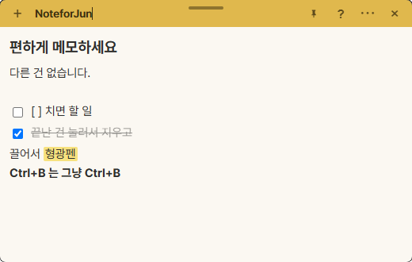

# NoteforJun

**Jun을 위한 노트앱**

> 편하게 메모하세요, 다른 건 없습니다.

윈도우 바탕화면에 붙는 스티키 메모입니다. 켜면 메모가 떠 있고, 거기에 적으면 됩니다. 저장 버튼도, 설정 화면도, 튜토리얼도 없습니다.



메모가 스스로를 설명합니다. 따로 읽을 설명서가 없습니다.

---

## 왜 또 메모 앱인가

메모 앱은 두 방향으로 실패합니다.

**기능이 너무 많은 쪽.** 노션이나 옵시디언은 큰 문제를 정리하기엔 좋습니다. 그런데 무언가를 적기 전에 "이걸 어디에, 어떤 형식으로 적지"를 먼저 정해야 합니다. 생각이 떠오른 순간과 그것을 적는 순간 사이에 결정이 끼어듭니다.

**편의 기능이 너무 많은 쪽.** 투두 앱들은 단축키와 알림을 편하라고 넣습니다. 그런데 그걸 익히다가, 익숙해질 무렵 앱 자체를 안 쓰게 됩니다.

결국 살아남는 건 윈도우 기본 스티키 노트입니다. 가볍고, 단순하고, 떠오른 순간 바로 적을 수 있습니다. 나중엔 규모가 큰 문제조차 스티키 노트로 처리하게 됩니다.

다만 스티키 노트에는 네 가지가 없습니다.

1. 메모가 쌓이면 뭐가 뭔지 구분이 안 됩니다
2. 체크박스가 없습니다
3. 형광펜이 없습니다
4. 글자 크기를 키울 수 없습니다

**NoteforJun은 스티키 노트에 이 네 가지만 채우고, 그 외에는 아무것도 더하지 않은 앱입니다.**

---

## 세 가지 원칙

### 1. 자유도를 없애는 것이 기능이다

스티키 노트가 살아남은 이유는 기능이 적어서가 아니라 **결정할 것이 없어서**입니다. 폰트, 글자 크기, 정렬, 여백을 미리 정해서 박아버리는 것 자체가 이 앱의 핵심 기능입니다.

**설정 화면이 없습니다.** 고를 수 있는 건 메모 색 6가지와 창 크기·위치뿐입니다.

### 2. 이 앱에서만 통하는 걸 배워야 하면, 넣지 않는다

`Ctrl+B`는 수십 년간 모든 프로그램에서 똑같이 동작해온 공용 지식입니다. 이미 알고 오시니 배울 게 없습니다. 반대로 이 앱만의 고유한 단축키나 문법은 배우는 비용이 생기므로 넣지 않습니다.

### 3. 발견되게 하되, 강요하지 않는다

`#`을 치면 글자가 커집니다. 모르고 안 써도 손해가 없습니다. 글자를 끌면 서식 버튼이 뜹니다. 안 써도 메모는 그대로 써집니다. 부가 기능은 전부 **몰라도 쓸 수 있고, 우연히 발견하면 이득인** 구조입니다.

---

## 쓰는 법

적으면 됩니다. 이게 전부입니다.

더 하고 싶어지면, 상단바 `?`에 커서를 올려보세요.

| 치는 것 | 되는 것 |
|---|---|
| `[]` + 스페이스 | ☐ 할 일 |
| `#` + 스페이스 | 제목 (큰 글씨) |
| `Ctrl+B` `I` `U` | 굵게 / 기울임 / 밑줄 |
| 글자 끌기 | 형광펜 포함 서식 팝업 |
| `Ctrl+Alt+N` | 새 메모 (어느 프로그램에 있든) |

그 외에 알아두면 좋은 것들입니다.

- **자동 저장** — 저장 버튼이 없습니다. 글을 쓰면 알아서 저장되고, 끝나면 작은 `✓`가 잠깐 떴다 사라집니다. 색이나 위치를 바꾼 것도 저장되지만 그땐 `✓`가 뜨지 않습니다. 눈으로 이미 보이니까요.
- **📌 고정** — 메모는 기본으로 다른 창 위에 떠 있습니다. 거슬리는 메모는 핀을 눌러 내려놓으면 되고, 메모마다 따로 기억합니다.
- **`×`는 치우기지 삭제가 아닙니다** — 닫은 메모는 목록에 남아 있습니다. 지우려면 목록 창에서 지워야 합니다. 삭제 경로는 하나뿐입니다.
- **컴퓨터를 껐다 켜면** 마지막에 쓰던 메모가 최대 5개까지 다시 떠 있습니다. 내용이 빈 메모는 빠집니다.
- **메모가 쌓이면** `⋯ → 모든 메모 보기`에서 색 띠와 미리보기로 훑고, 검색으로 찾습니다.

---

## 일부러 넣지 않은 것

무엇을 넣었는지보다 이쪽이 이 앱을 더 잘 설명합니다.

| 없는 것 | 이유 |
|---|---|
| 알림 / 리마인더 | 익히다가 앱 자체를 안 쓰게 되는 기능의 전형입니다 |
| 클라우드 동기화 | 1인 도구입니다. 서버가 필요해지는 순간 성격이 달라집니다 |
| 태그 / 폴더 / 정렬 | 분류를 강요하면 스티키 노트가 아니게 됩니다 |
| 다크 모드 / 테마 | 자유도를 없앤다는 원칙에 정면으로 어긋납니다 |
| 이미지 붙여넣기 | 메모 크기가 들쭉날쭉해집니다 |
| `##` 이하 소제목 | 메모에 문서 구조가 필요해지면 다른 도구를 쓸 때입니다 |
| 내보내기 | 저장 파일이 이미 사람이 읽을 수 있는 형태로 폴더에 있습니다 |
| 설정 화면 | 이 목록 전체가 설정 화면을 만들지 않기 위한 결정입니다 |

---

## 내 메모는 어디에 있나

`%APPDATA%\NoteforJun\notes\` 아래에 메모 하나당 JSON 파일 하나입니다.

서버에 올라가지 않습니다. 계정도, 로그인도 없습니다. 앱을 지워도 이 폴더는 남고, 메모장으로 열어도 내용이 읽힙니다.

---

## 만든 것

| | |
|---|---|
| 셸 | [Tauri v2](https://tauri.app) (Rust) — 윈도우에 이미 있는 웹뷰를 쓰므로 런타임을 같이 깔지 않습니다 |
| 편집기 | [TipTap](https://tiptap.dev) / ProseMirror — 한글 조합 입력을 제대로 다루는 몇 안 되는 선택지 |
| 빌드 | Vite |
| 테스트 | Vitest (화면) + `cargo test` (창·저장) |

```bash
npm install
npm run tauri dev     # 개발 중 실행
npm run tauri build   # 설치 파일 만들기

npm test                                        # 화면 테스트
cargo test --manifest-path src-tauri/Cargo.toml # 창·저장 테스트
```

---

## 설계 기록

이 앱은 결정마다 이유를 남기며 만들었습니다. 무엇을 만들었는지보다 **왜 그렇게 만들었고, 무엇을 만들지 않기로 했는지**가 적혀 있습니다.

- [설계 문서](docs/superpowers/specs/2026-09-11-noteforjun-design.md) — 문제 정의, 원칙, 화면 구성
- [사용성 개선](docs/superpowers/specs/2026-09-13-noteforjun-usability-design.md) — v1을 쓰면서 나온 수정과 그 판단

코드 주석도 같은 규칙을 따릅니다. "무엇을 하는가"가 아니라 "왜 이렇게 했는가"를 적습니다.
