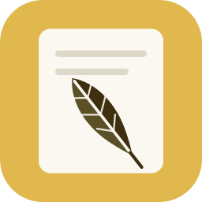
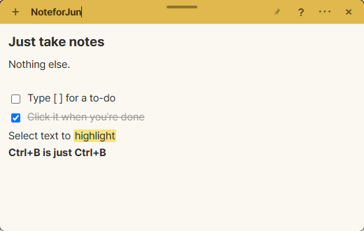

*English · [한국어](README.ko.md)*



# NoteforJun

**A note app made for Jun**

<br clear="left">

> Just take notes. Nothing else.



---

## Why I made this

I'm an ordinary university student.

I've installed task managers more times than I can count, and I always stalled at the same spot. Before writing anything down I had to decide **which project it belonged to, when it was due, what to tag it**. A decision wedges itself between having the thought and writing it down. Do that enough times and you stop writing things down at all.

So I kept going back to Windows Sticky Notes. It's open, you click, you type. That was the whole appeal. Eventually I was running fairly serious things out of sticky notes.

But living in it, a few things nagged.

- Once five or six notes pile up, you can't tell one from another
- I'm writing down things to do, and there are no checkboxes
- No way to highlight the line that matters
- The text is small and there's no way to make it bigger

**Wasn't there a notepad that nails the basics and stays light and clean?** I looked for a while, and then figured I'd make it.

NoteforJun is Sticky Notes with those four things filled in and **nothing else added**. Every time I was tempted to add one more thing, I asked first: *would this drag it back toward the reason I left task managers in the first place?*

---

## Three principles

### 1. Removing choices *is* the feature

Sticky Notes survived not because it has few features, but because there is **nothing to decide**. The font, the text size, the spacing, the alignment — nailing those down in advance is the core feature of this app, not a limitation of it.

**There is no settings screen.** What you can choose: one of six note colors, the window size and position, whether a note stays on top, and whether the app starts with Windows. That's the whole list. All four live in the `⋯` menu or on the title bar. There is no settings page to go into.

### 2. If you'd have to learn something that only works here, it doesn't go in

`Ctrl+B` has meant the same thing in every program for decades. You already know it, so there is nothing to learn. A shortcut or syntax invented for this app alone would cost you something to learn, so it stays out.

### 3. Discoverable, never required

Type `#` and the text gets bigger. Never knowing that costs you nothing. Select text and formatting buttons appear. Never using them costs you nothing either. Every extra is built so that you **can use the app without knowing it, and come out ahead if you stumble onto it**.

---

## How to use it

Write. That's the whole thing.

The first time you open the app, one note is already waiting. That note *is* the manual — by the time you've read it, you've seen everything the app does. Delete it when you're done and it won't come back.

When you want more, hover the `?` on the title bar.

| Type this | Get this |
|---|---|
| `[ ]` + space | ☐ a to-do |
| `#` + space | a heading |
| `Ctrl+B` `I` `U` | bold / italic / underline |
| select text | formatting popup, highlighter included |
| `Ctrl+Alt+N` | a new note, from anywhere |

A few other things worth knowing.

- **Autosave** — there is no save button. What you write is saved on its own, and a small `✓` blinks when it lands. Color and position changes are saved too, but quietly — you can already see those happened.
- **📌 Pin** — pinning keeps that one note above other windows. Pin only what you want to keep in sight; each note remembers its own setting.
- **`×` puts a note away, it does not delete it** — closed notes stay in the list. Deleting happens in the list window, and only there. There is exactly one way to delete a note.
- **After a restart**, up to five notes you were last working in come back. Notes with an empty body are skipped.
- **When notes pile up**, `⋯ → All notes` gives you color stripes, previews, and search.

---

## Left out on purpose

This list describes the app better than the feature list does.

| Not here | Why |
|---|---|
| Reminders / notifications | The textbook example of a feature you learn and then quit over |
| Cloud sync | This is a tool for one person. The moment it needs a server, it becomes a different thing |
| Tags / folders / sorting | Forcing you to file things is what stops it being a sticky note |
| Dark mode / themes | Directly against the principle of removing choices |
| Pasting images | Note sizes start jumping around |
| `##` and deeper headings | If a note needs document structure, it's time for a different tool |
| Export | The saved files are already human-readable, sitting in a folder |
| A settings screen | This entire list exists so that there doesn't have to be one |

---

## Where your notes live

Under `%APPDATA%\NoteforJun\notes\` — one JSON file per note.

Nothing is uploaded. No account, no login. Uninstalling the app leaves the folder alone, and you can open any note in a text editor and read it.

---

## Built with

| | |
|---|---|
| Shell | [Tauri v2](https://tauri.app) (Rust) — uses the WebView already on Windows, so no runtime ships with it |
| Editor | [TipTap](https://tiptap.dev) / ProseMirror — one of the few that handles CJK composition input properly |
| Build | Vite |
| Tests | Vitest (UI) + `cargo test` (windows, storage) |

```bash
npm install
npm run tauri dev     # run while developing
npm run tauri build   # produce the installer

npm test                                        # UI tests
cargo test --manifest-path src-tauri/Cargo.toml # window and storage tests
```

### Language

The app follows your OS language: Korean on a Korean system, English everywhere else. There is no language picker — people want to work in the language their computer is already set to, and asking again would be asking a question that's already been answered.

---

## Design notes

This app was built leaving the reasoning behind each decision in writing. They record **why it was built this way, and what was decided against** — which matters more here than what was built.

The documents are in Korean.

- [Design document](docs/superpowers/specs/2026-09-11-noteforjun-design.md) — the problem, the principles, the screens
- [Usability pass](docs/superpowers/specs/2026-09-13-noteforjun-usability-design.md) — what changed after living with v1, and why

Code comments follow the same rule: not *what* this does, but *why* it is this way.

---

## License

[MIT](LICENSE) © 2026 Jun Oh
